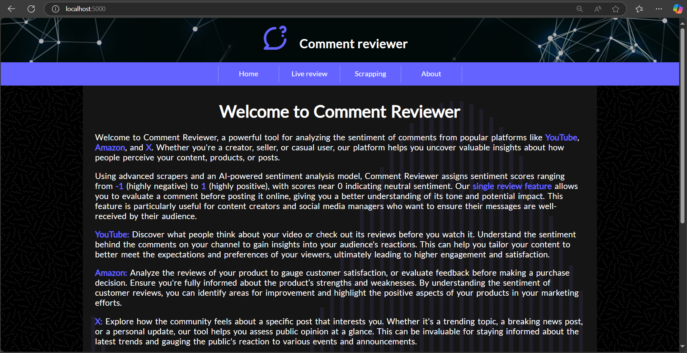
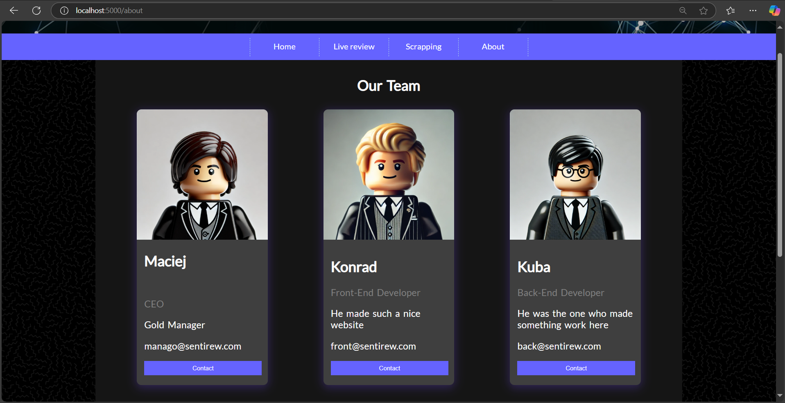
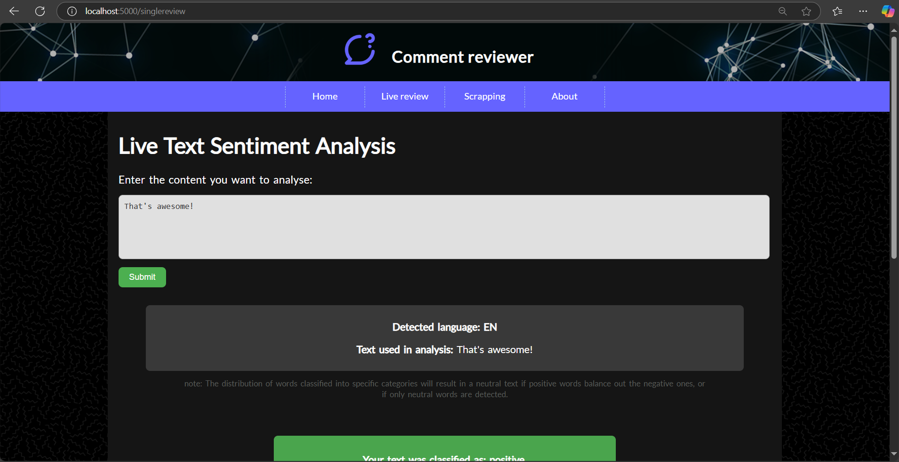
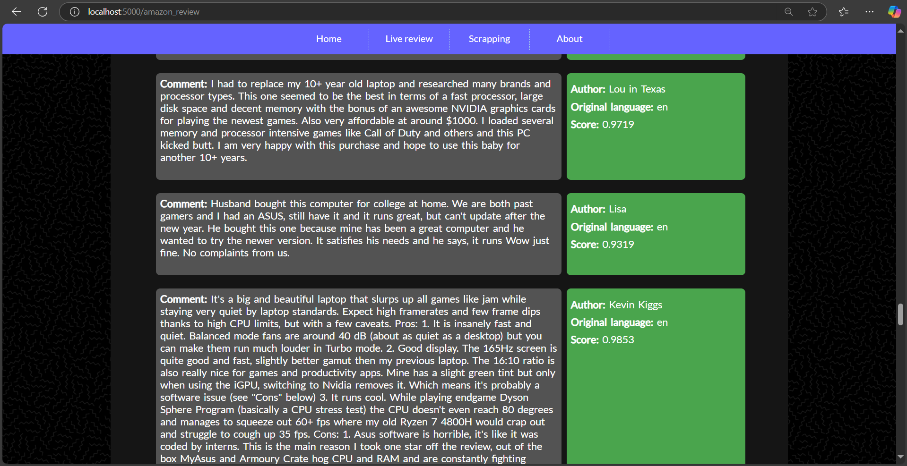
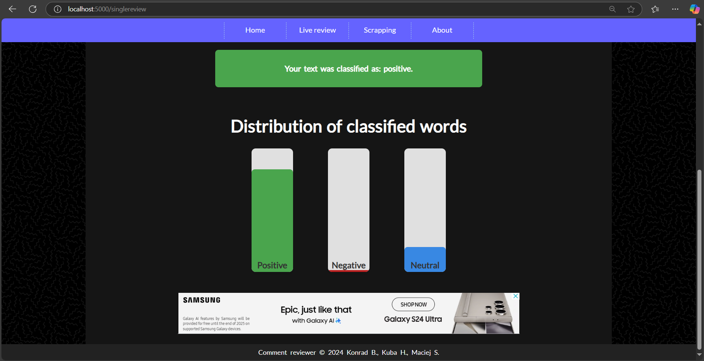
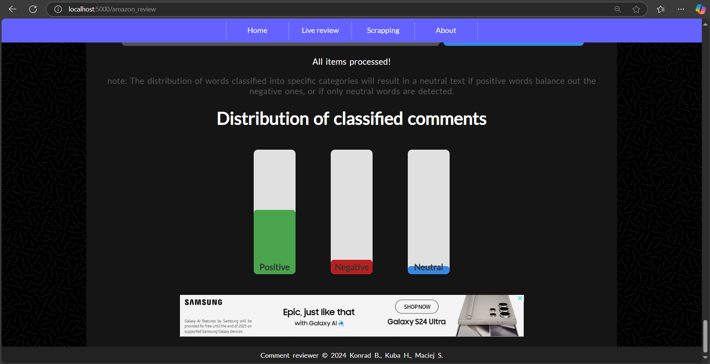

# Sentiment Analysing Web Application Project
This project is a comprehensive web application designed to analyze sentiment from various online sources. It leverages advanced natural language processing (NLP) techniques to determine the sentiment of text data, categorizing it as positive, negative, or neutral. The application can scrape data from multiple platforms, including Amazon for product reviews, Twitter (X) for tweets, and YouTube for video comments, using provided credentials. 

The application uses several Python libraries:
- `googletrans` for translating text to the desired language,
- `google-api-python-client` for interacting with the YouTube API,
- `playwright` for automated web scraping,
- `nltk` for performing NLP tasks such as tokenization, stemming, and sentiment analysis,
- `asyncio` for handling asynchronous operations,
- `flask` for building the web interface,
- `typing` for type hints,
- `simplejson` for JSON processing,
- `pandas` for data manipulation and analysis.

The application is built with a modular architecture, making it easy to extend and maintain. It supports asynchronous operations to improve performance and responsiveness. The web interface, built with Flask, provides an intuitive user experience for interacting with the sentiment analysis features.

# Project overview

<p align="center">
    
    &nbsp;&nbsp;&nbsp;&nbsp;
    
</p>
<p align="center">
   
   &nbsp;&nbsp;&nbsp;&nbsp;
   
</p>
<p align="center">
   
   &nbsp;&nbsp;&nbsp;&nbsp;
   
</p>

# Download the repository
Clone the repository:
```sh
git clone https://github.com/Macsok/Sentiment-Analysis-Application
cd Sentiment-Analysis-Application
```

# Prerequsites
`Python=>3.10.0`


<!-- # Used libraries (details in requirements.txt file)
`googletrans` `google-api-python-client` `playwright` `nltk` `asyncio` `flask` `typing` `simplejson` `pandas` -->


# Using Virtualenv (on Windows)
Use virtualenv to isolate project dependencies, ensuring no conflicts between different projects.
First, install Virtualenv if you haven't already:
```sh
pip install virtualenv
```
Navigate to main project directory and create a new virtual environment:
```sh
python -m virtualenv myvenv
```
Activate the Virtual Environment:
```sh
python -m source myenv/Scripts/activate
```
When activated, your shell will show the virtual environment’s name in the prompt.

Now that the environment is active, you can install packages:
```sh
pip install -r requirements.txt
```
Once you have finished working on your project, it’s a good habit to deactivate its venv. By deactivating, you leave the virtual environment.
```sh
deactivate
```
Delete the Virtual Environment (if your virtual environment is in a directory called 'venv':):
```sh
rm -r myvenv
```
> [!NOTE]
> You can learn more about virtual environments at: https://python.land/virtual-environments/virtualenv


# Browser installation
```sh
python -m playwright install firefox
```
> [!NOTE]
> Alternatively you can try: npx playwright install firefox


# Adding credentials
To use online scrapers you need to provide credentials to your platforms. Create new directory in main project folder (Sentiment-Analysis-Application) called 'credentials'. Then add 3 files to it: AMAZON, X, YT_API_KEY. Each file should consist of:
### AMAZON:
- email
- password
### X:
- username
- password
- email
### YT_API_KEY:
- API key (more at: https://developers.google.com/youtube/v3)


> [!TIP]
> You can still use 'live review' without providing any credentials to your platforms.


# Running
To run this application, ensure you have followed all the setup steps mentioned above, including cloning the repository, setting up the virtual environment, installing the required packages, and adding the necessary credentials.

Once everything is set up, you can start the application by running the following command in your terminal:
```sh
python run.py
```
This will launch the web application, and you can access it through your web browser to start analyzing sentiments from various online sources. 

> [!TIP]
> Visit `localhost:5000/` to see the results.
